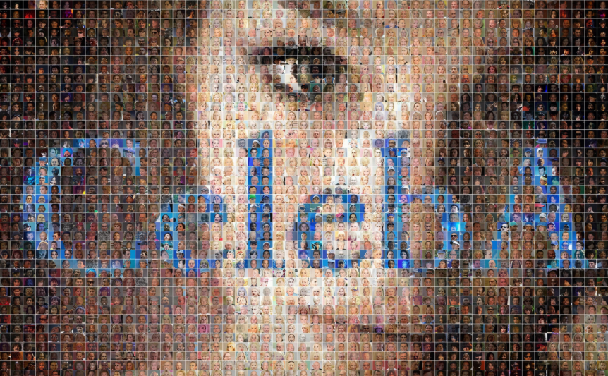

## CelebA repository introduction
[CelebA official website](https://link.zhihu.com/?target=http%3A//mmlab.ie.cuhk.edu.hk/projects/CelebA.html)  
  

CelebFaces Attributes Dataset (CelebA) is a large-scale face attributes dataset with more than 200K celebrity images, each with 40 attribute annotations. The images in this dataset cover large pose variations and background clutter. CelebA has large diversities, large quantities, and rich annotations, including:  
* 10,177 number of identities,  
* 202,599 number of face images, and  
* 5 landmark locations, 40 binary attributes annotations per image.  
The dataset can be employed as the training and test sets for the following computer vision tasks: face attribute recognition, face detection, landmark (or facial part) localization, and face editing & synthesis.

----  
## Fold description:
> Align & Cropped: Normalized image with 218 x 178 resolution (face is centered)  
> In the wild: Original unprocessed image  

## File descriptions:  
> list_attr_celeba.csv:  List for 40 binary attributes for each image  
> list_bbox_celeba.csv:  List for bounding box  
> list_landmarks_align_celeba.csv: List for 5 facial landmarks   

----

