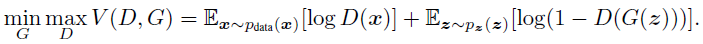
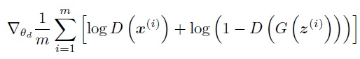
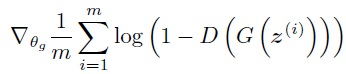

## Loss function for GAN 

 
  
The adversarial framework is comprised of a generator network and a discriminator network.
The generator G(z;g) maps input latent space pz(z) to fake image space Xg with parameter g. 
The discriminator output D(x) represents the probability that x came from the real imaga space (Xd)
rather than Pg. GAN train D to maximize the probability of assing correct label to both training examples and samples from G.
At same time, G is trained to minimize the cost. In other words, D and G plat the following two-player minimax game with function V(G,D).  

----  
## Content 
* [Vanilla GAN](https://github.com/RyanWu2233/SAGAN_CelebA/blob/master/Losses.md#vanilla-gan)  
* [LS GAN](https://github.com/RyanWu2233/SAGAN_CelebA/blob/master/Losses.md#ls-gan)  
* [WGAN](https://github.com/RyanWu2233/SAGAN_CelebA/blob/master/Losses.md#wgan)  
* [WGAN-GP](https://github.com/RyanWu2233/SAGAN_CelebA/blob/master/Losses.md#wgan-gp)  


----  
## Vanilla GAN  
> Ref: "Generative Adversarial Nets"  
> by Ian J. Goodfellow, Jean Pouget-Abadiey, Mehdi Mirza, Bing Xu, David Warde-Farley, Sherjil Ozairz, Aaron Courville, Yoshua Bengiox, 2014  

The original GAN paper provides proto-type GAN loss definition from JS divergence.  
>   

In real implementation, GAN uses two seperate loss function for discriminator (D) and generator (G) seperately.  
> D loss:   
> G loss:   

The above definition is also called saturation loss. JS divergence exhibits two problem:  
(1) It is constant when Pg and Pd is non-overlapped  
(2) It is constant when Pg and Pd is fully overlapped  
The first problem introduces 'gradient vanish' at beginning of training and makes GAN hard to convergence. The second roblem also introduces 'gradient vanish' at end of training and stops model training. To solve the problems, the author proposed Non-saturation GAN which uses log D(G(z)) to replace log(1 - D(G(z))). It does great help to make the convergence easier. However, it introduces another problem called 'mode collapse'.  

TensorFlow code V2.1: 
``` TensorFlow
def GAN_loss(d_real, d_fake):   
    BCE = tf.keras.losses.BinaryCrossentropy(from_logits= True)  
    G_loss = BCE(tf.ones_like(d_fake),  d_fake)  
    D_lossR= BCE(tf.ones_like(d_real),  d_real)  
    D_lossF= BCE(tf.zeros_like(d_fake), d_fake)  
    D_loss =  D_lossR + D_lossF  
    return G_loss, D_loss  
```
----  
## LS GAN  
> Ref: "Least Squares Generative Adversarial Networks"  
> by Xudong Mao, Qing Liy1, Haoran Xiez, Raymond Y.K. Laux, Zhen Wang, and Stephen Paul Smolley, 2015  


TensorFlow code V2.1: 
``` TensorFlow
def LSGAN_loss(d_real, d_fake):   
    MSE = tf.keras.losses.MeanSquaredError()
    G_loss = MSE(tf.ones_like(d_fake),  d_fake)
    D_lossR= MSE(tf.ones_like(d_real),  d_real)
    D_lossF= MSE(tf.zeros_like(d_fake), d_fake) 
    D_loss = D_lossR + D_lossF
```

----  
## WGAN  
> Ref: "Wasserstein GAN" 
> by Martin Arjovsky, Soumith Chintala, and Leon Bottou, 2017  


``` TensorFlow
def WGAN_loss(d_real, d_fake):   
    G_loss = -tf.reduce_mean(d_fake)
    D_lossR= -tf.reduce_mean(d_real)
    D_lossF=  tf.reduce_mean(d_fake)
    D_loss = D_lossR + D_lossF
```

----
## WGAN GP
> Ref: "Improved Training of Wasserstein GANs"
> by Ishaan Gulrajani, Faruk Ahmed, Martin Arjovsky, Vincent Dumoulin, Aaron Courville, 2017  


----
## DRAGAN  


----
## 


