## Loss function for GAN 

 
  
The adversarial framework is comprised of a generator network and a discriminator network.
The generator G(z;g) maps input latent space pz(z) to fake image space Xg with parameter g. 
The discriminator output D(x) represents the probability that x came from the real imaga space (Xd)
rather than Pg. GAN train D to maximize the probability of assing correct label to both training examples and samples from G.
At same time, G is trained to minimize the cost. In other words, D and G plat the following two-player minimax game with function V(G,D).  

----  
## Content 
* [Vanilla GAN](https://github.com/RyanWu2233/SAGAN_CelebA/blob/master/Losses.md#vanilla-gan)  
* [LS GAN](https://github.com/RyanWu2233/SAGAN_CelebA/blob/master/Losses.md#ls-gan)  
* [WGAN](https://github.com/RyanWu2233/SAGAN_CelebA/blob/master/Losses.md#wgan)  
* [WGAN-GP](https://github.com/RyanWu2233/SAGAN_CelebA/blob/master/Losses.md#wgan-gp)  
* [Hinge loss](https://github.com/RyanWu2233/SAGAN_CelebA/blob/master/Losses.md#hinge-loss-from-geometric-gan)
* [R1 regularization](https://github.com/RyanWu2233/SAGAN_CelebA/blob/master/Losses.md#r1-regularzation)

----  
## Vanilla GAN  
> Ref: "Generative Adversarial Nets"  
> by Ian J. Goodfellow, Jean Pouget-Abadiey, Mehdi Mirza, Bing Xu, David Warde-Farley, Sherjil Ozairz, Aaron Courville, Yoshua Bengiox, 2014  

The original GAN paper provides proto-type GAN loss definition from JS divergence.  
   

In real implementation, GAN uses two seperate loss function for discriminator (D) and generator (G) seperately.  
 D loss:   
 G loss:   

The above definition is also called saturation loss. JS divergence exhibits two problem:  
(1) It is constant when Pg and Pd is non-overlapped  
(2) It is constant when Pg and Pd is fully overlapped  
The first problem is 'gradient vanish' at beginning of training and makes GAN hard to convergence. The second problem is 'gradient vanish' at end of training stage and stops model training. To solve the problems, the author proposed Non-saturation GAN which uses log D(G(z)) to replace log(1 - D(G(z))). It does great help to make the convergence easier. However, it introduces another problem called 'mode collapse'.  

 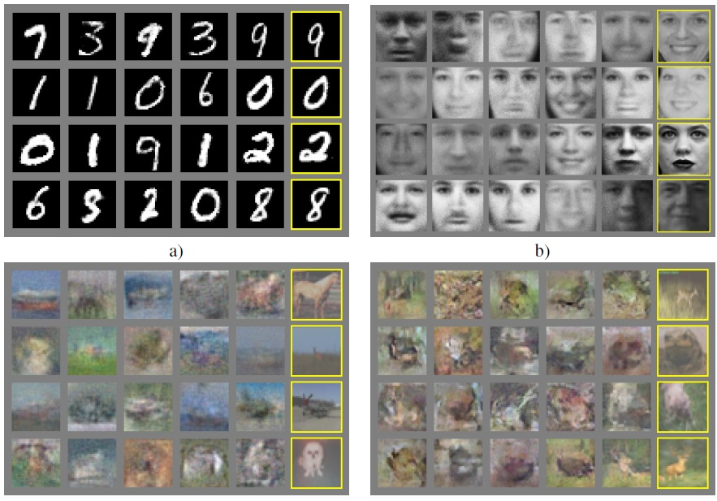  

TensorFlow code V2.1 for NSGAN: 
``` TensorFlow
def GAN_loss(d_real, d_fake):   
    BCE = tf.keras.losses.BinaryCrossentropy(from_logits= True)  
    G_loss = BCE(tf.ones_like(d_fake),  d_fake)  
    D_lossR= BCE(tf.ones_like(d_real),  d_real)  
    D_lossF= BCE(tf.zeros_like(d_fake), d_fake)  
    D_loss =  D_lossR + D_lossF  
    return G_loss, D_loss  
```
----  
## LSGAN  
> Ref: "Least Squares Generative Adversarial Networks"  
> by Xudong Mao, Qing Liy1, Haoran Xiez, Raymond Y.K. Laux, Zhen Wang, and Stephen Paul Smolley, 2015  

The loss function of LSGAN is shown below. Unlike vanilla GAN, it tends to minimize the Pearson Chi-Square distance instead of JS divergence.
 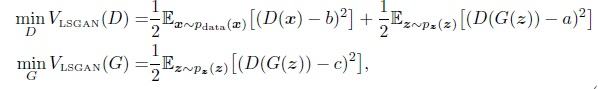  

Minimizing the objective function of regular GAN suffers from vanishing gradients, which makes it hard to update the generator. 
LSGAN can relieve this problem because LSGAN penalizes samples based on their distances to the decision boundary. 
The author also demonstrates that LSGAN is equivalent to minimize Peason Chi-Square distance and can Generate more realistic images.
The benefit of LSGAN is good convergence behavior. The drawback of LSGAN is severe 'mode collapse' problem.

 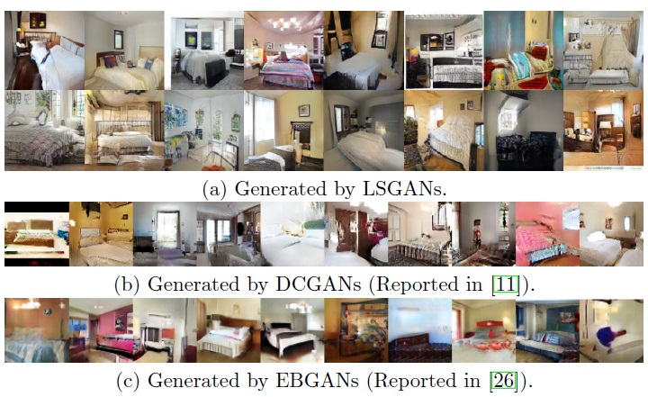  

TensorFlow code V2.1 for LSGAN: 
``` TensorFlow
def LSGAN_loss(d_real, d_fake):   
    MSE = tf.keras.losses.MeanSquaredError()
    G_loss = MSE(tf.ones_like(d_fake),  d_fake)
    D_lossR= MSE(tf.ones_like(d_real),  d_real)
    D_lossF= MSE(tf.zeros_like(d_fake), d_fake) 
    D_loss = D_lossR + D_lossF
```

----  
## WGAN  
> Ref: "Wasserstein GAN"  
> by Martin Arjovsky, Soumith Chintala, and Leon Bottou, 2017  

This paper aims to solve the following problem: What does it mean to learn a probability distribution? 
It analysis vanilla GAN loss (JS divergence) and point out the problem of (1) hard to convege (2) training stop.
Root cause is that GAN loss saturates at both beining and ending stages.
The remedy is to use the EM distance (Earth Mover distance or Wasserstein distance) as distance metric:  
 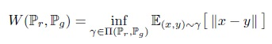  
Below plot shows that EM distance is linear at both left and right end. It guarantees the slope (gradient) for convergence.
By using EM distance as loss function, GAN can find the correct gradient to minimize the distance between Pd and Pg. 
Furthermore, the gradient is not zero when Pd is similar to Pg and training can continue go on.  
 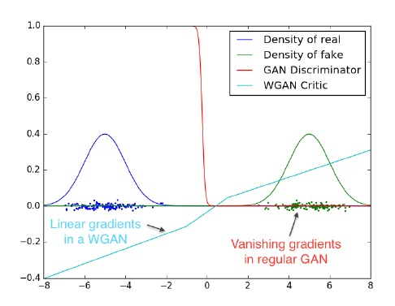  

EM distance, however, is computation-hunger. The author solved this problem by using Kantorovich-Rubinstein duality. 
It can be estimated by solving following equation.
Just in case that discriminator obeys 1-Lipschitz constraint and the loss function becomes:  
 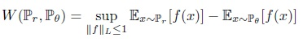  

The above equation looks similar to original vanilla GAN loss and is easier to compute. Quite simple and elegant. 
Below simulation result shows that the generated image quality (IS score) improves as WGAN loss decrease.  
 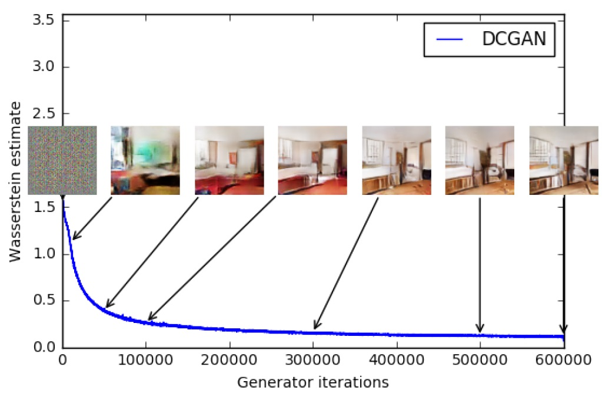  

TensorFlow code V2.1 for WGAN (with weight clipping): 
``` TensorFlow
def WGAN_loss(d_real, d_fake):   
    G_loss = -tf.reduce_mean(d_fake)
    D_lossR= -tf.reduce_mean(d_real)
    D_lossF=  tf.reduce_mean(d_fake)
    D_loss = D_lossR + D_lossF
rsmprop = RMSprop(clipvalue=1)   # Weight clipping
```

----
## WGAN GP
> Ref: "Improved Training of Wasserstein GANs"  
> by Ishaan Gulrajani, Faruk Ahmed, Martin Arjovsky, Vincent Dumoulin, Aaron Courville, 2017  

WGAN paper significantly improves GAN training stability. However, the solution for 1-Lipschitz (say, weight clipping) introduces another problems.
The first issue comes from how to choose clipping value properly. It is model dependent hyer-parameters and hard to choose when model becomes deeper. 
Second issue is the model presentation capability is limited (distributed as dual-peaks). Third issue is quite slow training.  
 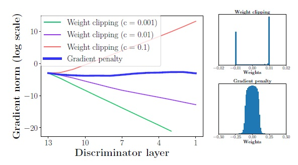  
In this paper, author proposed using gradient penalty to replace weight clipping. 
It dramastically solves the above three issues realted to weight clipping WGAN. The loss function now becomes:  
 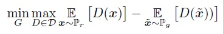  

WGAN-GP also reduces 'mode collapse' problem.  
 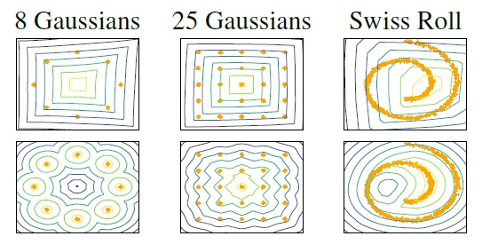  

Training speed is much faster than WGAN also.  
 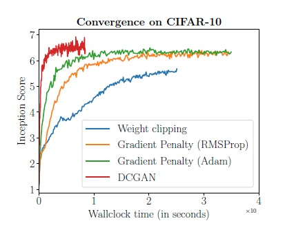  

Even more simulation results from original paper:  
 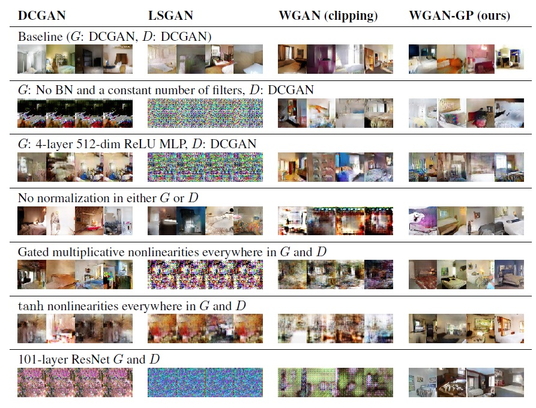  

TensorFlow code V2.1 for WGAN-GP: 
``` TensorFlow
def WGAN_loss(d_real, d_fake, X_loss):   
    G_loss = -tf.reduce_mean(d_fake)
    D_lossR= -tf.reduce_mean(d_real)
    D_lossF=  tf.reduce_mean(d_fake)
    D_loss = D_lossR + D_lossF
    D_loss = D_loss + Gradient_Penalty * X_loss
    
def WGAN_GP(real_img, fake_img):
    epsilon = tf.random.uniform([real_img.shape[0],1,1,1], 0.0, 1.0) # Interpolation ratio
    x_img   = epsilon * real_img + (1-epsilon) * fake_img
    with tf.GradientTape() as X_tape:
        X_tape.watch(x_img)
        d_x    =   D(x_img, training = True)
    X_grad = X_tape.gradient(d_x, x_img)
    ddx    = tf.sqrt(tf.reduce_sum(x_grad ** 2, axis=[1,2,3]))
    X_loss = tf.reduce_mean(ddx - 1.0) **2)
    return X_loss
```

----
## Hinge Loss (from Geometric GAN)  
> Ref "Geometric GAN"  
> by Jae Hyun Lim, Jong Chul Ye, 2017  

This paper proposes another GAN loss definition (Hinge loss). The concept is derived from SVM (Support Vector Machine).
Famous GAN paper like SNGAN (spectral normalization) and SAGAN (self attention) also use hinge loss as loss function.  
 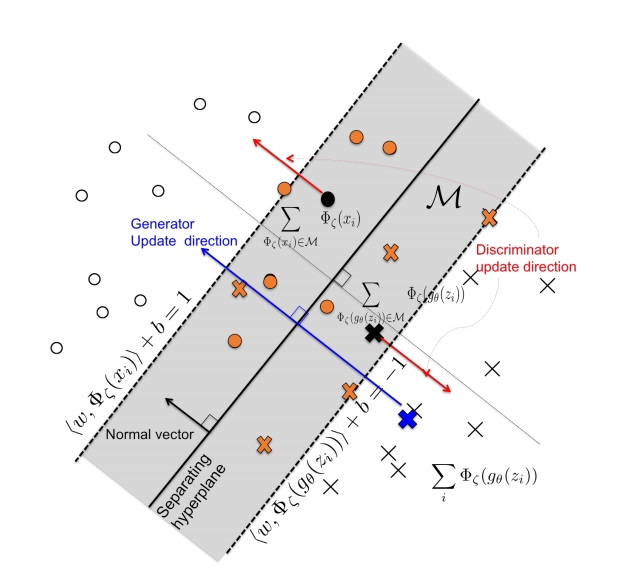  

TensorFlow code V2.1 for Hinge loss V1: 
``` TensorFlow
def HINGE1_loss(d_real,d_fake):                     #-- Hinge loss type 1 
    G_loss =  tf.reduce_mean(tf.maximum(1 - d_fake , 0))
    D_lossR=  tf.reduce_mean(tf.maximum(1 - d_real , 0))
    D_lossF=  tf.reduce_mean(tf.maximum(1 + d_fake , 0))
    D_loss = D_lossR + D_lossF
    return G_loss, D_loss
```

TensorFlow code V2.1 for Hinge loss V2: 
``` TensorFlow
def HINGE2_loss(d_real,d_fake):                     #-- Hinge loss type 2
    G_loss =  tf.reduce_mean(-d_fake)
    D_lossR=  tf.reduce_mean(tf.maximum(1 - d_real , 0))
    D_lossF=  tf.reduce_mean(tf.maximum(1 + d_fake , 0))
    D_loss = D_lossR + D_lossF
    return G_loss, D_loss
```

----
## R1 Regularzation
> Ref "Which Training Methods for GANs do actually Converge?"  
> by Lars Mescheder, Andreas Geiger, Sebastian Nowozin,  2018  

This paper compare different GAN training schemes and loss function using Kinetics. 
It shows that saturation loss and WGAN-GP could not converge to real data distribution.
Non-saturating GAN can converge but take long time. 
It also proposed R1 and R2 regularization (modification from WGAN-GP) which can converge very well.  
 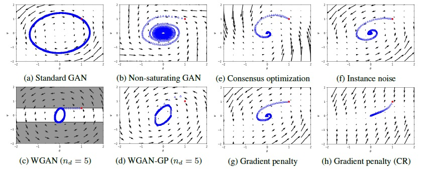  

The modification is simple and the result is amazing. NVIDIA's famous style GAN2 also use NSGAN + R1 regularization.  
The differnce between R1 and R2 regularization relies on image source. 
R1 regularization computes gradient penalty from real image while
R2 regularization computes gradient penalty from fake image. The performance difference between R1 and R2 is negligible.  

Training results:
 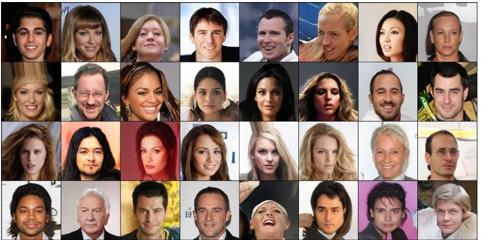  
 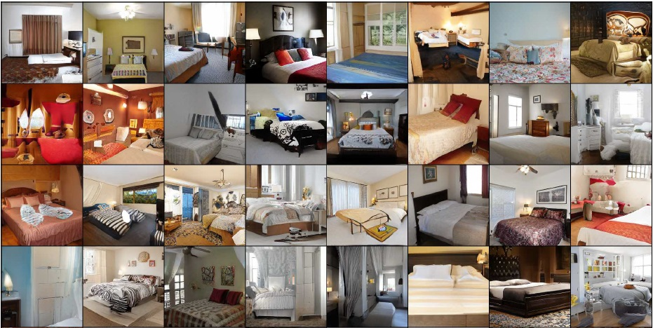  
 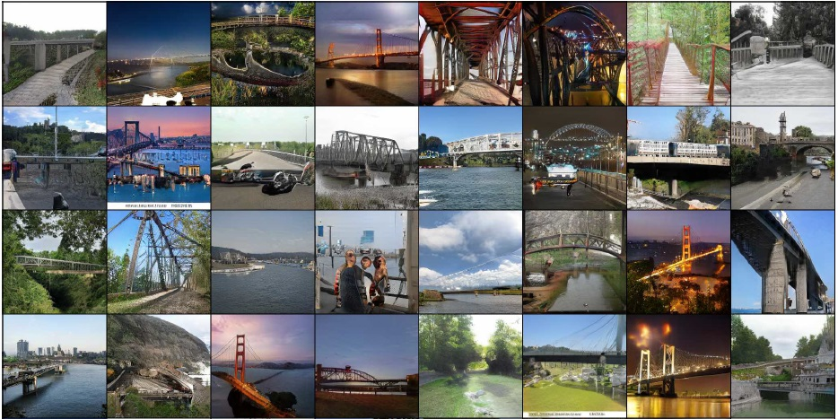  
 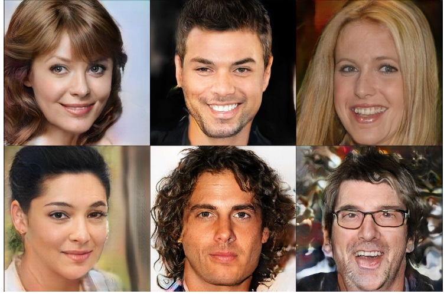  

TensorFlow code V2.1 for R1 Regularization: 
``` TensorFlow
def R1_GP(r_img, f_img, D):
    with tf.GradientTape() as X_tape:
        X_tape.watch(r_img)  
        x_dout = D(r_img,training= True)   
    X_grad = X_tape.gradient(x_dout, r_img)   
    ddx    = tf.sqrt(tf.reduce_sum(X_grad ** 2, axis=[1,2,3]))
    X_loss = tf.reduce_mean((ddx) ** 2)    
    return X_loss
```

