## Main stream GAN network ##  
 
----  
## Content
* [DCGAN](https://github.com/RyanWu2233/SAGAN_CelebA/blob/master/Model.md#dcgan)  
* [Checkboard artifact](https://github.com/RyanWu2233/SAGAN_CelebA/blob/master/Model.md#checkboard-artifacts)
* [Resnet](https://github.com/RyanWu2233/SAGAN_CelebA/blob/master/Model.md#resnet)  
* [Self attention](https://github.com/RyanWu2233/SAGAN_CelebA/blob/master/Model.md#self-attention)  
* [Self modulate](https://github.com/RyanWu2233/SAGAN_CelebA/blob/master/Model.md#self-modulate)  
* [Style GAN](https://github.com/RyanWu2233/SAGAN_CelebA/blob/master/Model.md#style-gan)  

----  
## DCGAN
> **["Unsupervised representation learning with deep convolutional GAN"](https://arxiv.org/abs/1511.06434)  
> by Alec Radford & Luke Metz, Soumith Chintala, 2016**  

When Ian.Goodfellow first proposed GAN netowrk on 2014, everybody is exciting for it's elegant concept and capability. 
But they soon found that GAN is quite difficult to train. 
On 2016, DCGAN provides CNN based structure which is robust and easy to train. 
Until now, almost all GAN image generation works follow DCGAN's structure.  
DCGAN first maps the 128 dimensional noise tensor into 4x4 low resolution image with 1024 filters. 
Then the resolution is up-sampled by 2 and filter number halves in every stage. 
In final stage, convolution layer with channels=3 is used to map the final output to RGB space. 
Tanh activation layer is used to clip output in the range [-1 ~ +1].
It is then mapping to 0~256 for image display purpose.
 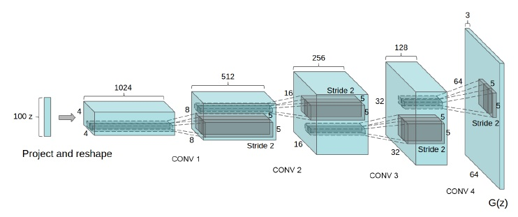  

Detail network for generator and discriminator are shown below:
 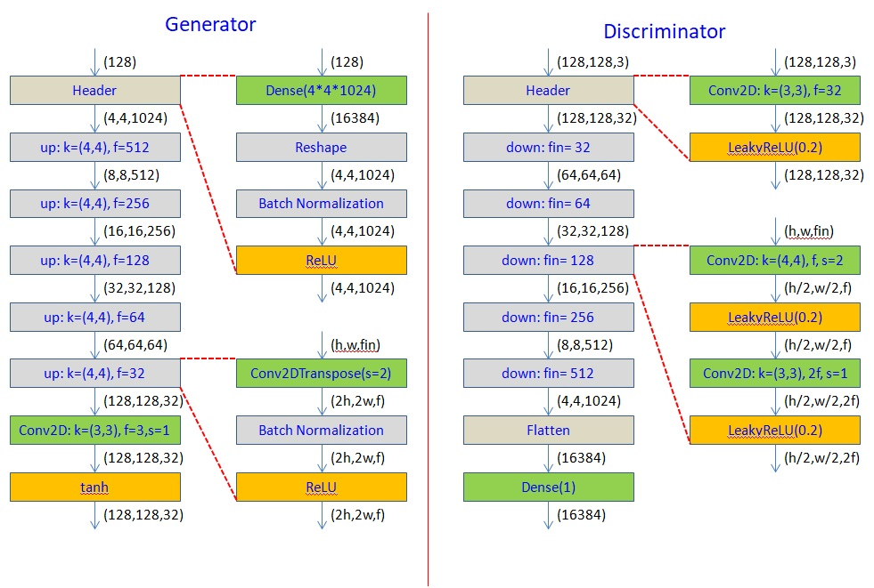  
 
***Generator design tips:***  

**Noise vector**  
* Input noise vector should be distributed around unit sphere (vector norm ~ 1). 
* Image interpolation should be computed along with unit sphere (not straight line).  
**Header**  
* Mapping to 4 x 4 resolution first.  
**For each stage**  
* Use Conv2DTranspose to upsample (kernel=(4,4), stride=2).  
* Double resolution and halves fileter number for each stage.  
* Use batch normalization to ensure convergence.  
* Use ReLU (LeakyReLU is even better).  
**Output stage**  
* Convert to RGB by Conv2D (kernel=(1,1) or (3,3), stride=2, channels=3).  
* Output image should be bounded to [-1 ~ +] by tanh function.  

***Discriminator design tips:***  

**Input image**  
* Input image should be normalized to [-1 ~ +1].  
* Real image and fake image should be trained separately.  
**For each stage**  
* Halves resolution and double fileter number for each stage.  
* Do not use batch normalization in discriminator. 
* Use Conv2D to downsample first (kernel=(4,4), stride=2, channels= f).  
* Then, use another Conv2D to smooth (kernel=(3,3), stride=1, channels= 2f).  
* Apply Leaky ReLU for after each Conv2D.  
**Output stage**
* Use Dense(1) to generate discriminator output

----  
## Checkboard artifacts  
> **["Deconvolution and Checkerboard Artifacts"](https://distill.pub/2016/deconv-checkerboard/)  
> by Augustus Odena, Vincent Dumoulin, Chris Olah, 2017**  

The standard approach of producing images with deconvolution — despite its successes! — has some conceptually simple issues that lead to artifacts in produced images. Conv2D and Conv2DTranspose with stride = 2 generates periodic noise pattern (n=2 for last layer, n=4 for last two layer). Using a natural alternative without these issues causes the artifacts to go away (Analogous arguments suggest that standard strided convolutional layers may also have issues):  
* The upsample Conv2DTranspose(stride=2) layer is replaced by UpSample2D(2) + Conv2D(stride=1)  
* The downsample Conv2D(stride=2) layer is replaced by Conv2D(stride=1) + AveragePooling2D(2)  

 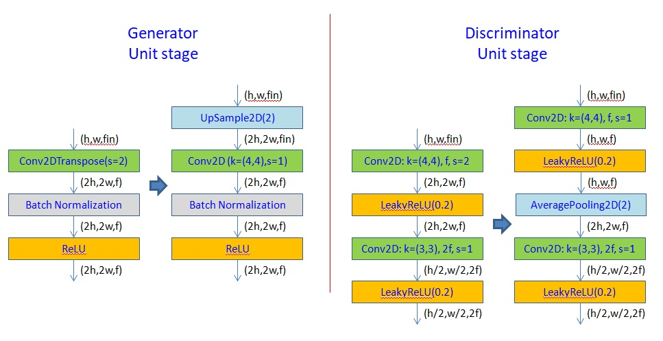  

*Checkboard effect example*  
 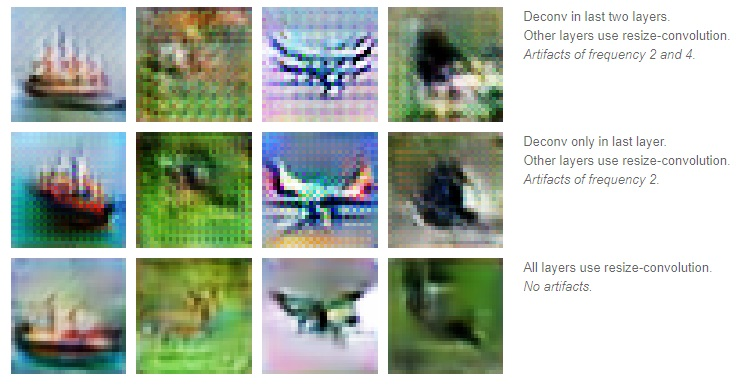  
 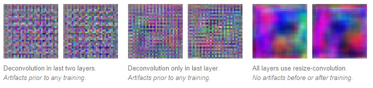  
 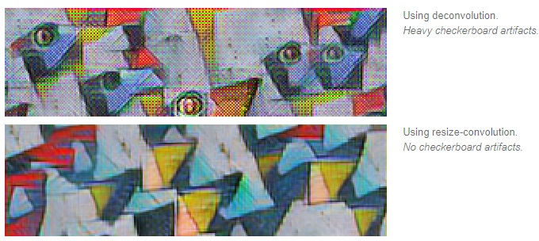  

----
## Resnet  
> **["Deep Residual Learning for Image Recognition"](https://arxiv.org/abs/1512.03385)  
> by Kaiming He, Xiangyu Zhang, Shaoqing Ren, Jian Sun, 2015  
> ["Identity Mappings in Deep Residual Networks"](https://arxiv.org/abs/1603.05027)  
> by Kaiming He, Xiangyu Zhang, Shaoqing Ren, Jian Sun, 2016**

Resnet is proposed by He. for Imagnet classification job on 2015. It soon proves that Resnet performs well even in GAN image generation. Famous GAN architecture like SAGAN, SNGAN used Resnet architecture to improve image quality. NVIDIA Style GAN2 claims that by using Resnet for discriminator and skip-connection for generator achieves best image quality. Detail resnet architecture is shown below. Notice that resnet has several different type. Demoed one comes from NVIDIA style GAN2.  
 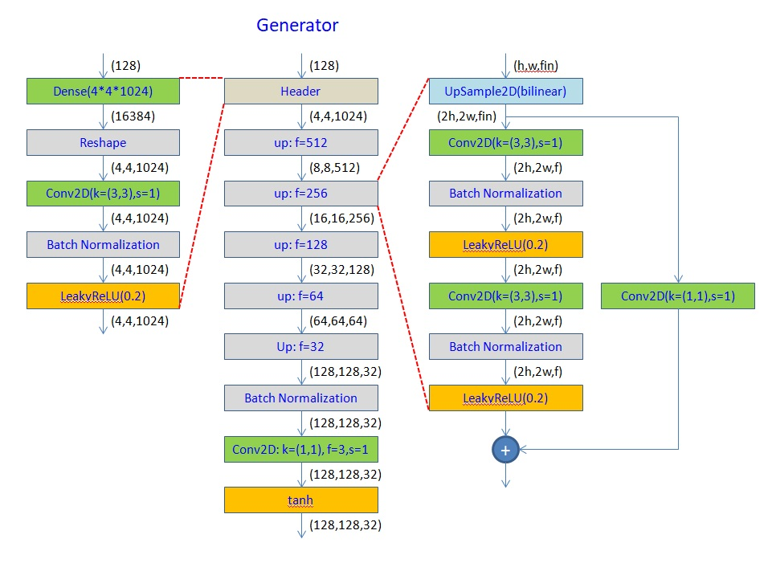  
 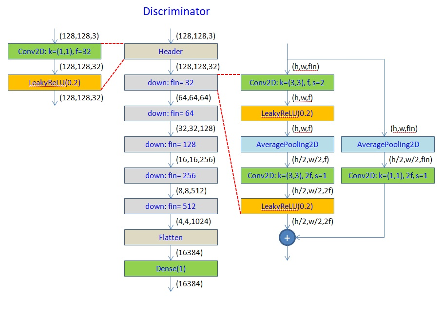  
 
----
## Self attention  (SAGAN)
> **["Non-local Neural Networks"](https://arxiv.org/abs/1711.07971)  
> by Xiaolong Wang, Ross Girshick, Abhinav Gupta1, Kaiming He, 2017  
> ["Self-Attention Generative Adversarial Networks"](https://arxiv.org/abs/1805.08318)  
> by Han Zhang, Ian Goodfellow, Dimitris Metaxas, Augustus Odena, 2017**  

SAGAN allows attention-driven, long-range dependency modeling for image generation tasks. 
Traditional CNN GANs use only spatially local points in lower-resolution feature maps. 
In SAGAN, details can be generated using cues from all feature locations. 
It performs better than prior work, boosting the best published (on 2017) Inception score from 36.8 to 52.52
and reducing FID from 27.62 to 18.65 on challenging Imagenet dataset.  

The self attention layer reshapes input [H,W,C] into [HxW,C]. Then, it do matrix multiply as [HxW,C] x [C,HxW] to compute relation between each pixel.   
 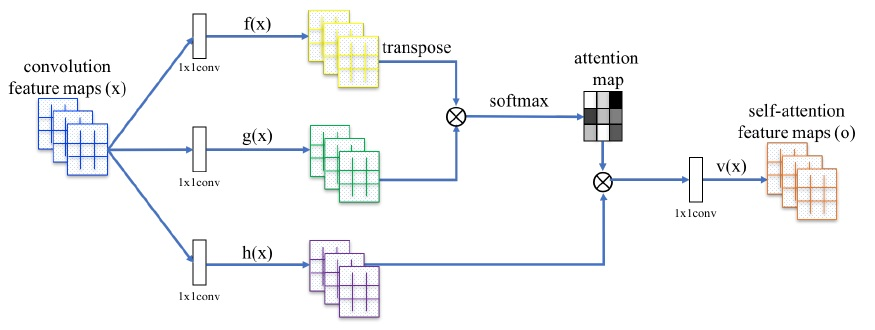  
 Following image exhibits that attention layer can successfully link related pixel together.
 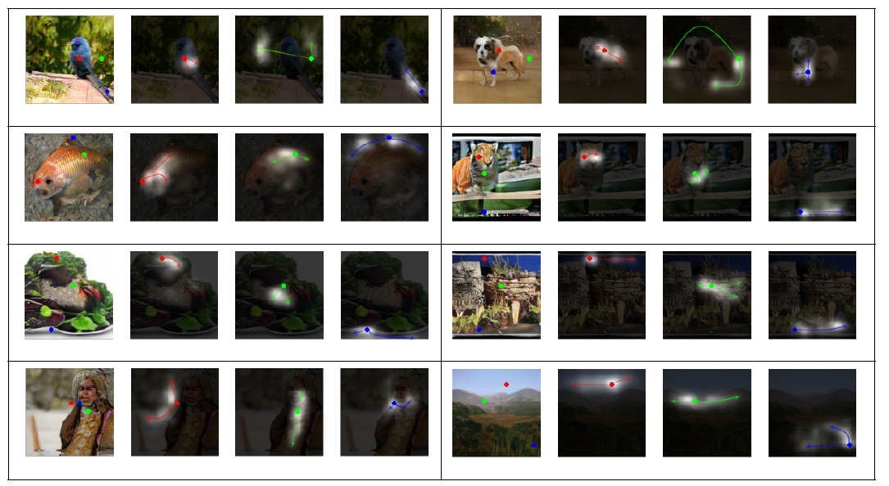  
 By introducing self attention mechanism, it achieves SOTA on 2017. Some results are:  
 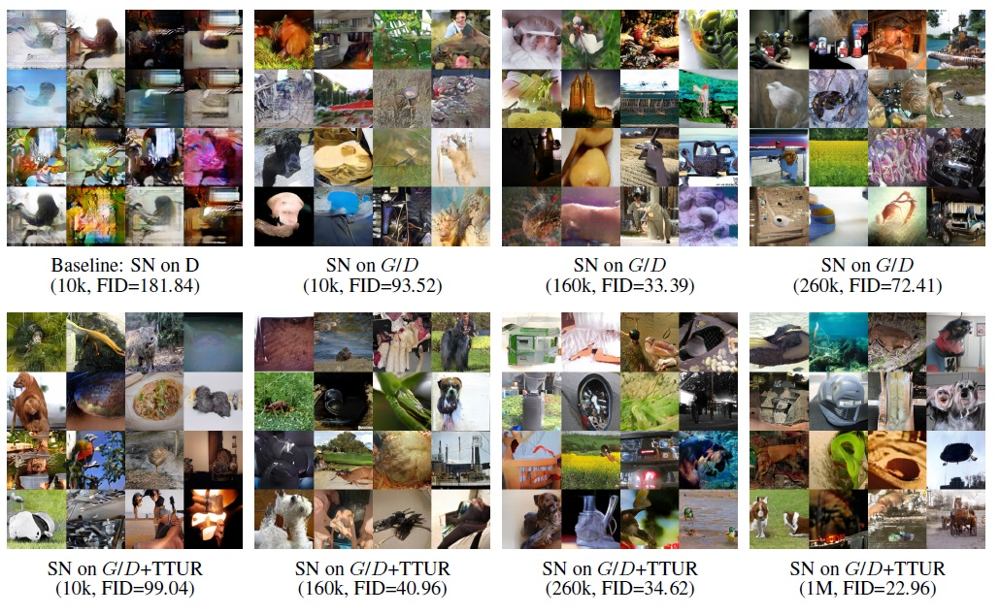  
 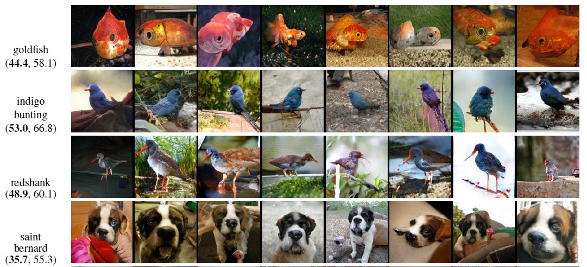  

----  
## Self modulate  
> **["Perceptual Losses for Real-Time Style Transfer and Super-Resolution"](https://arxiv.org/abs/1603.08155)  
> by Justin Johnson, Alexandre Alahi, Li Fei-Fei, 2016  
> ["On self modulation for generative adversarial networks"](https://openreview.net/pdf?id=Hkl5aoR5tm)  
> by Ting Chen, Mario Lucic, Neil Houlsby, Sylvain Gelly by 2017**  

GAN can easily generate good quality images for low-to-middle resolution (up to 128 x 128). 
But it is quite difficult to generate high resolution images (up to 512 x 512, or higher). 
The great success fof style-transfer implies that human perceptual is related to statistics of convolution layer output (mean and variation). 
Batch normalization layer is just used to adjust the mean and variation. 
Therefore, always remember not to train real images and fake images simultaneously. 
It would 'mix' the style between real and fake image batch and lower the perceptual quality.  
The original spectral normalization paper uses conditional batch norm in their generator model. 
hile this greatly improves the quality of the generated samples, this model is no longer fully unsupervised. 
Chen et al. have recently proposed a new type of layer that allows intermediate feature maps to be modulated by the input noise vector instead of labels.  
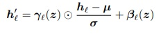  

Self modulation network implementation:  
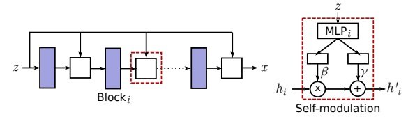  

----
## Style GAN  
> **["A Style-Based Generator Architecture for Generative Adversarial Networks"](https://arxiv.org/abs/1812.04948)  
> by Tero Karras, Samuli Laine, Timo Aila, 2018  
> ["Semantic Image Synthesis with Spatially-Adaptive Normalization"](https://arxiv.org/abs/1903.07291)  
> by Taesung Park, Ming-Yu Liu, Ting-Chun Wang, Jun-Yan Zhu, 2018**  
> 
> [Code for Style GAN2 on FFHQ generation](https://github.com/RyanWu2233/Style_GAN2_FFHQ)  
> [Code for Style GAN2 on Waifu generation](https://github.com/RyanWu2233/Style_GAN2_TWDNE)  

The successful story for CBN (conditional batch normalization) and self modulation indicate a broad way. 
NVIDIA further expands this idea to image translation (SPADE, GAUGAN) and unsupervised GAN (Style GAN). 
The style gan network are shown below:  
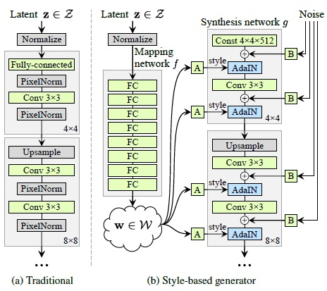  

Generator of style GAN is comprised of 2 network. Mapping network (Gm) maps the spherical symmetric Gaussian distribution space Z into disentangled space W. 
Then, W tensor control style of each resolution by style layer.  
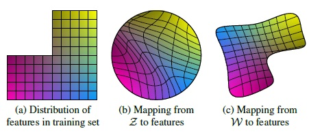  

The generated images are shown below. It's incredible and amazing:
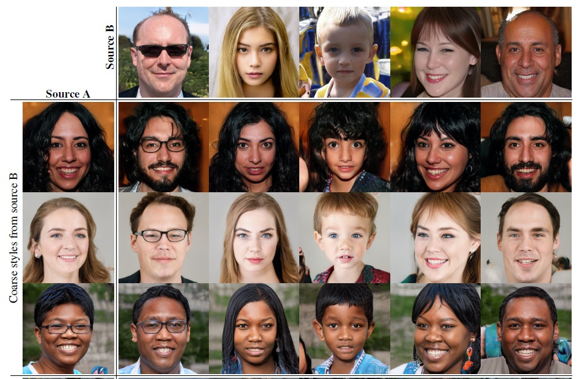  

