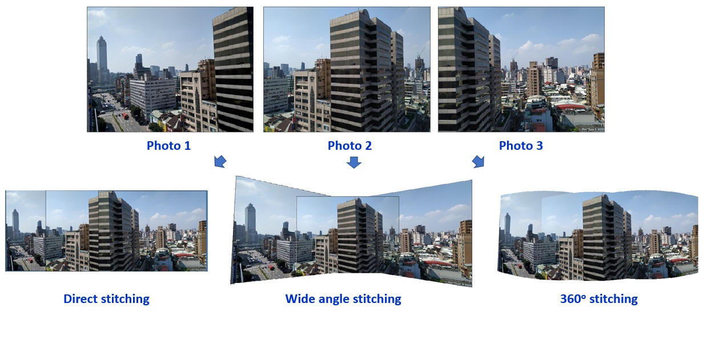
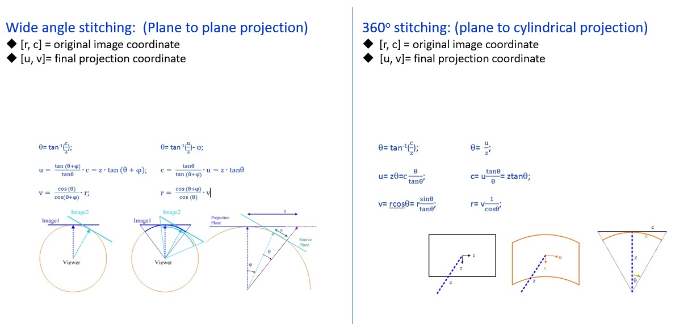
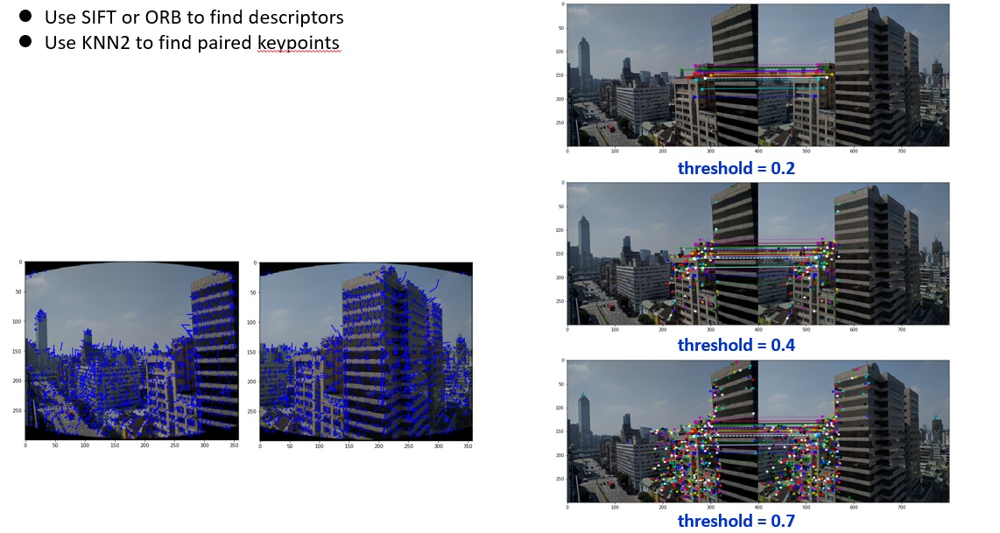
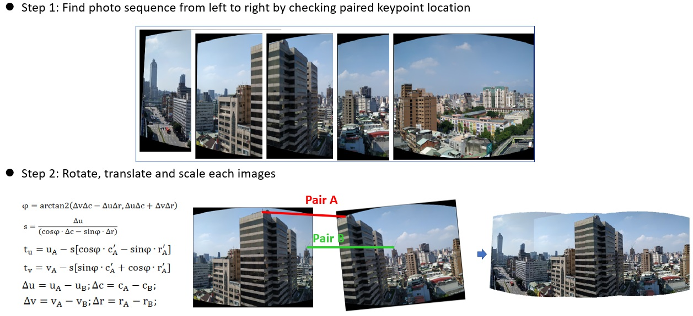
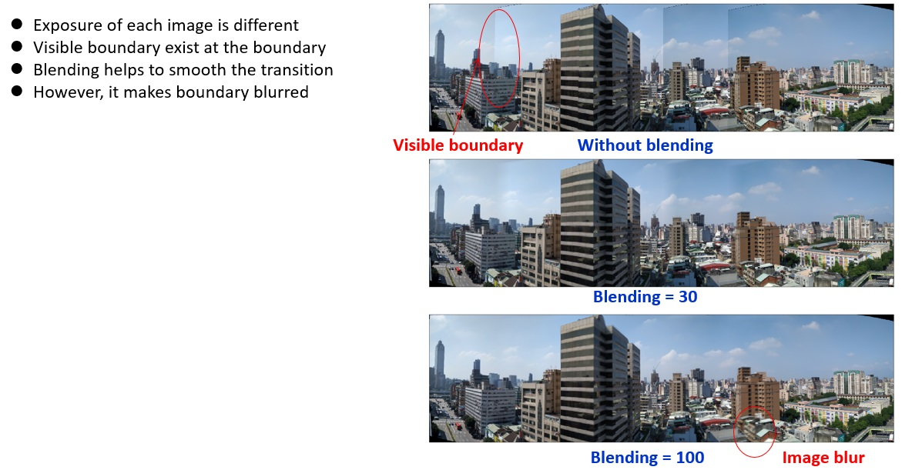
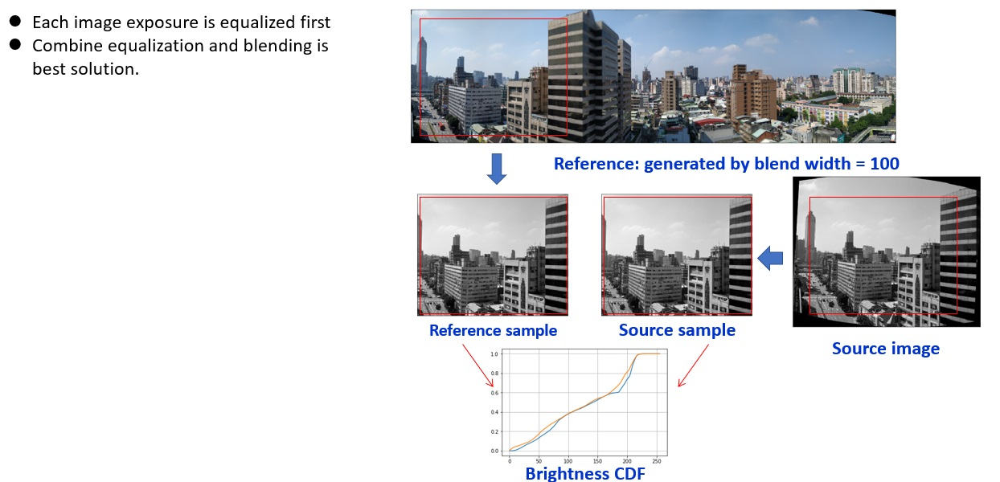
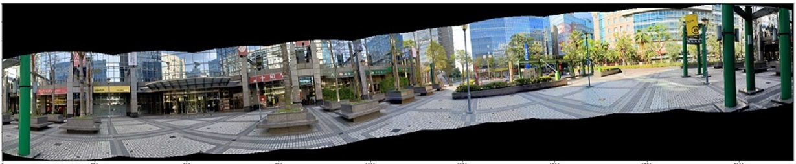
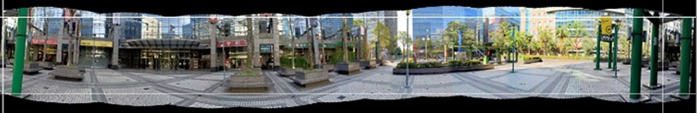
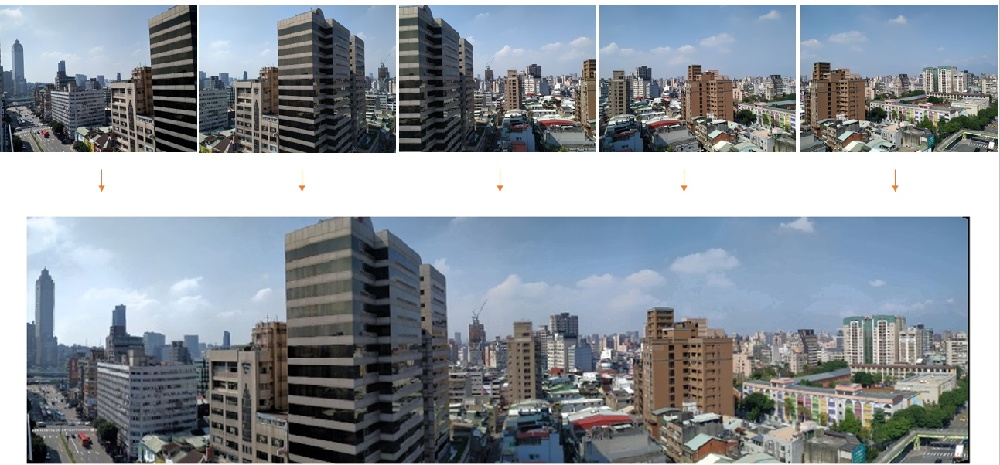
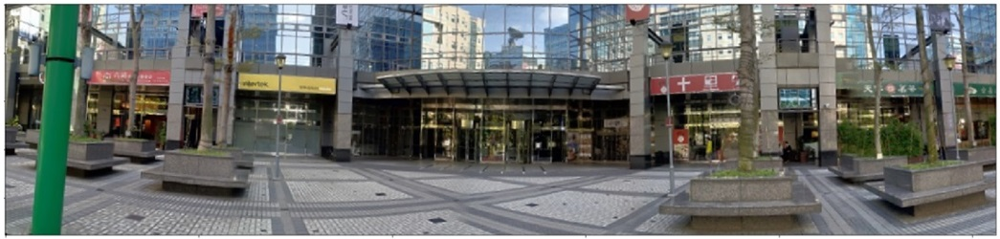

## Panorama
 

----
## Image stitching

  

----
## Image projection

----
## Find descriptors
  

----
## Image translation, rotation, scaling and stitching
  

----
## Blending

----
## Intensity equalization

----
## Head-to-tail connection, cropping

----
## Final Example

----
## Another example
   

